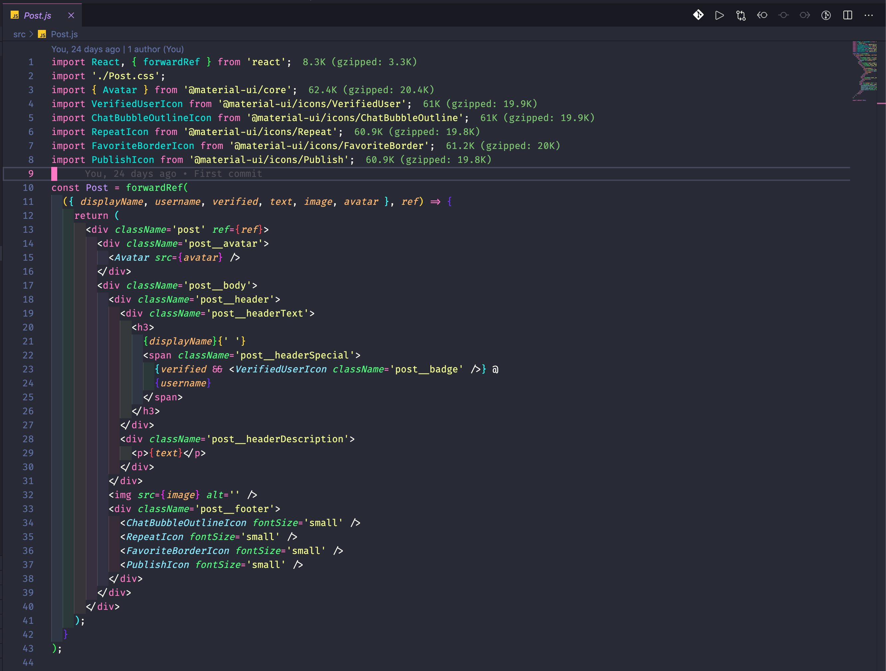

# Digi-Angler Theme for VS Code

Thanks for checking out my VS Code theme.

## Installation

1. Open the extensions sidebar on Visual Studio Code
1. Search for Digi-Angler Dark Theme
1. Click Install
1. Click Reload to reload your editor
1. Select the Manage Cog (bottom left) > Color Theme ＞ Digi-Angler Dark Theme
1. 🌟🌟🌟🌟🌟 Rate five-stars 😃

## Issues & Suggestions

For any issues or suggestions, please use [GitHub issues](https://github.com/digiangler/digi-angler-dark-theme/issues).

**Enjoy!**
